# Host Profiling 常用检测工具

在AI模型训练与推理过程中，经常会遇到Device上执行空泡，最终定位到是Host侧下发卡顿导致的，下面介绍一些定位Host侧下发问题的常用方法

##### 1. 获取子线程pytorch算子信息

由于社区pytorch profiler机制的限制，只能在一个线程里（即profiler开启的线程）采集torch算子（如`aten::*`）信息，子线程是采集不到的，如下图用例所示：
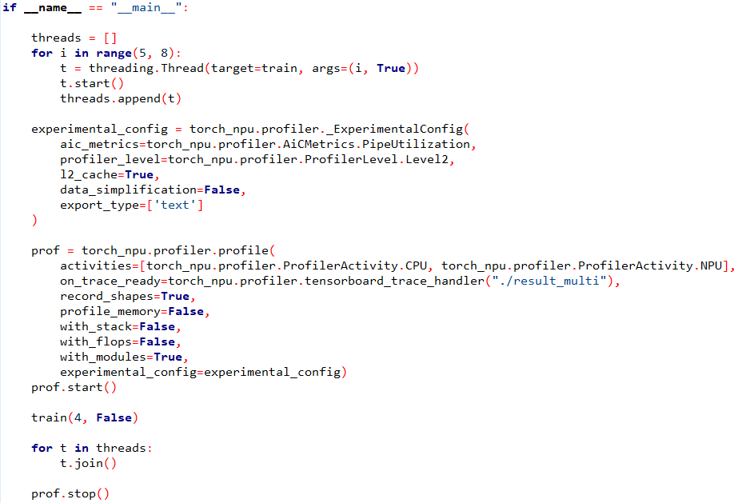
除了主线程外，另外启动三个子线程，调用同样的train，最终采集到的Profiling结果是这样的
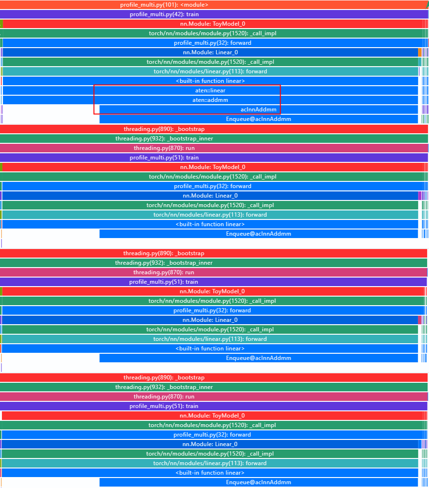
此时可以使用torch-npu profiler在930版本新增的特性，在子线程中额外调用`enable_profiler_in_child_thread`和`disable_profiler_in_child_thread`接口，即可以在子线程中也采集到框架侧的torch算子信息了
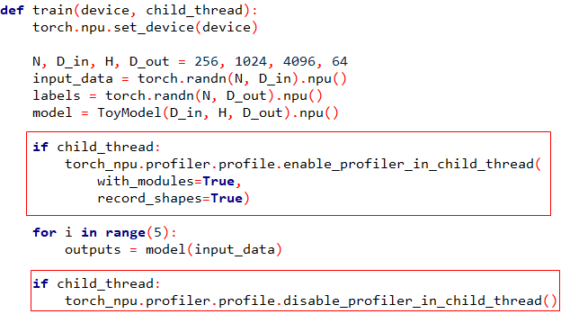
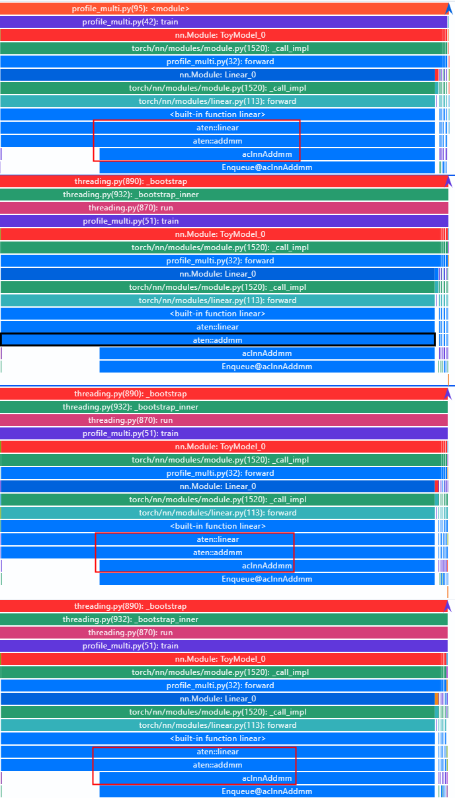

##### 2. 获取框架侧所有线程的python调用栈

当前pytorch profiler对框架侧python调用栈数据进行了筛选，只会呈现有torchop或taskqueue线程的数据，如果用户进程中创建的python子线程比较多，需要观察其他子线程的调用栈，可以使用附件中的临时脚本`python_trace_parse`导出（后续会加到pytorch profiler正式版本中）

```bash
python3 python_trace_parse.py ./profiler_info.json ./FRAMEWORK
```

其中`profiler_info.json`和`FRAMEWORK`是pytorch profiler采集到的原始文件，用户采集时需要开启with_stack或者with_mudules选项
命令执行完成后会在当前目录下生成`python_tracer.json`文件，用[perfetto](https://ui.perfetto.dev)或mindstudio insight打开，即可查看用户进程所有python线程的调用栈
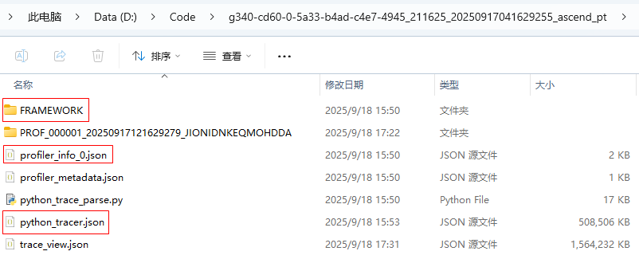
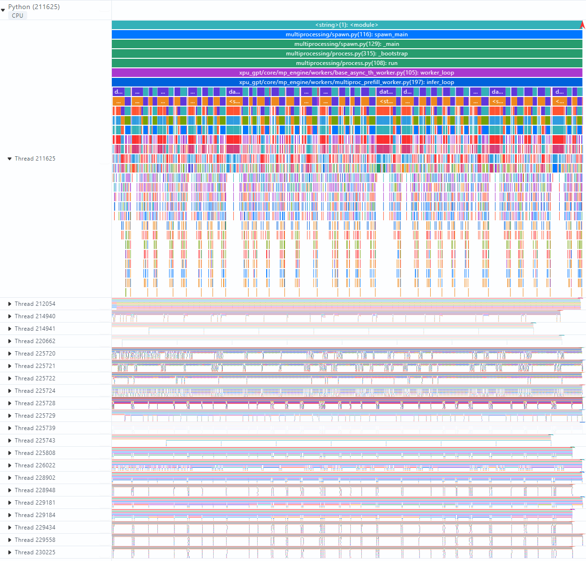
通过对比模型前向线程或反向线程在下发算子耗时过长的时刻，其他python线程的行为，查看是否有线程切换或者GIL锁的情况，造成了下发线程的卡顿

##### 3. 查看进程的系统调用

如果怀疑host侧下发卡顿是操作系统调用导致的，可以使用perf trace工具采集特定进程的系统调用情况，示例如下：

```bash
perf trace -T --syscalls -p pid
```

如采集pid为`1724730`的系统调用

```bash
perf trace -T --syscalls -p 1724730
```

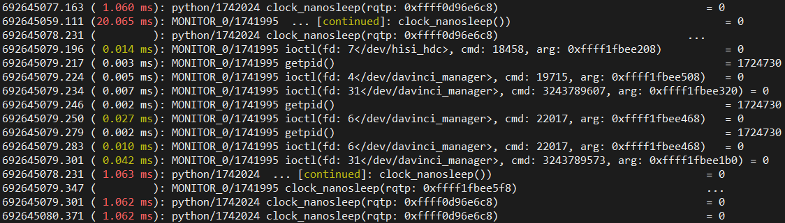
默认情况下会采集所有的系统调用信息，数量可能会很多，可以加一个duration参数控制，只采集耗时大于duration（单位：ms）的系统调用
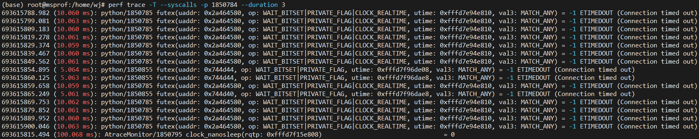

##### 4. perf-trace-viewer

[perf-trace-viewer](https://github.com/cisco-open/perf-trace-viewer)是一款开源工具，基于`perf sched`命令，采集cpu核上的调度流水图，对于判断绑核是否成功，模型进程在执行过程中是否被其他进程抢占，非常有用。
首先从[https://github.com/cisco-open/perf-trace-viewer/releases](https://github.com/cisco-open/perf-trace-viewer/releases)下载最新的perf-trace-viewer工具脚本`collect`和`perf_trace_viewer`
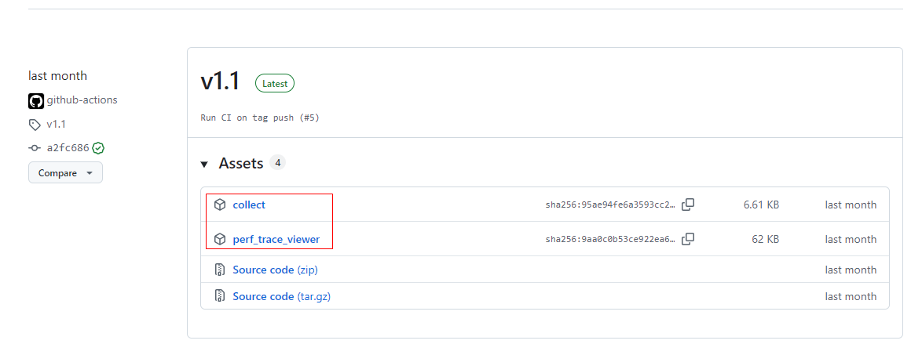
在模型运行过程中，在另一个终端执行

```bash
# 10 表示采集10s的数据
./collect 10
# 或仅采集CPU0,2,3核的数据
# ./collect -o "-C 0,2-3" 10
```

等待采集完成后会在当前目录下生成`perf-data-***.tar.xz`的文件，执行`perf_trace_viewer`命令进行解析

```bash
./perf_trace_viewer perf-data-***.tar.xz cpu_trace.json
```

等待解析完成后，将生成的CPU调度流水图cpu_trace.json拖到[perfetto](https://ui.perfetto.dev)中，即可查看这10s中CPU核上进程的调度，以及用户进程里每个线程的调度情况
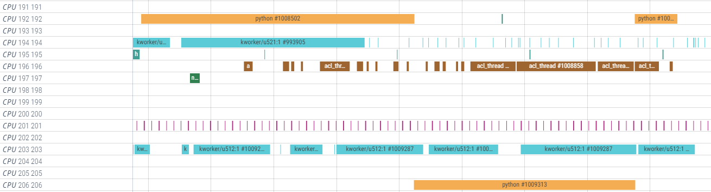
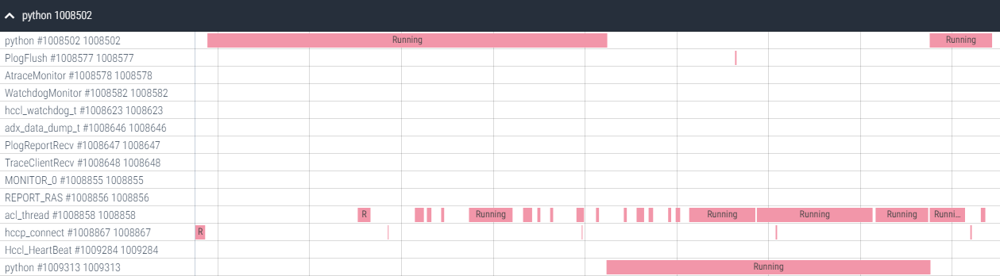
CPU调度流水图对于判断绑核是否成功，算子下发线程（acl_thread）在执行过程中是否被抢占，是否发生了迁移的情况非常有帮助

##### 5. perf record

Perf record 是 Linux 系统性能分析工具 perf 的核心命令，用于录制系统的性能数据（如 CPU 周期、指令、缓存命中、分支预测等事件），并生成一个名为 perf.data 的分析文件，供后续的 perf report 或其他工具进行深入分析

1. 执行以下命令采集进程`1275545`在`10`秒内的性能数据，生成`perf.data`文件

```bash
perf record -g -p 1275545 -- sleep 10
```

2. 将`perf.data`转换为中间脚本格式

```bash
perf script -i perf.data > out.perf
```

3. 折叠堆栈跟踪（需要[FlameGraph](https://github.com/brendangregg/FlameGraph)脚本）

```bash
# 假设已克隆FlameGraph项目到当前目录
./FlameGraph/stackcollapse-perf.pl out.perf > out.folded
```

4. 生成SVG火焰图

```bash
./FlameGraph/flamegraph.pl out.folded > process_flamegraph.svg
```

使用浏览器打开svg文件即可查看进程的堆栈调用情况
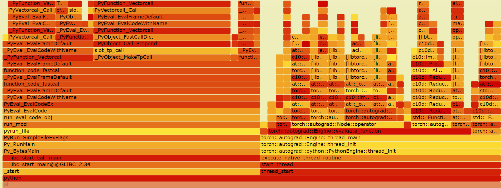

##### 6. trace-cmd

[trace-cmd](https://www.trace-cmd.org/Documentation/trace-cmd/)是 Linux 上强大的内核跟踪工具 ftrace 的一个前端命令行工具。它封装了直接操作 /sys/kernel/debug/tracing/ 下复杂文件的过程，提供了更简单易用的命令接口

下面介绍几个核心子命令的使用方法

###### 1) `trace-cmd record` - **记录跟踪数据**

这是最常用的命令，用于开始捕获跟踪数据。

* **功能**：启用指定的跟踪器或事件，并开始记录内核活动，直到被中断（如 `Ctrl-C`）。数据会保存在当前目录的 `trace.dat` 文件中。
* **常用选项**：
  
  * `-p <tracer>`: 指定跟踪器（plugin），如 `function`, `function_graph`, `nop` 等。
  * `-e <event>`: 启用特定跟踪事件。可以指定多个 `-e`。使用 `-e` 选项时，`-p` 指定的跟踪器会被忽略。
    * `-e sched:sched_switch` (跟踪进程切换)
    * `-e irq:irq_handler_entry` (跟踪中断处理函数入口)
    * `-e all` (启用所有事件，慎用，数据量巨大)
  * `-f <filter>`: 设置过滤器，仅跟踪符合条件的函数或事件。
    * `-f 'pid == 1234'` (只跟踪 PID 为 1234 的进程)
    * `-f 'comm == python'` (只跟踪名为 `python` 的进程)
  * `-l <function>`: 仅跟踪指定的函数（相当于设置 `set_ftrace_filter`）。
  * `-n <function>`: 不跟踪指定的函数（相当于设置 `set_ftrace_notrace`）。
  * `-F <command>`: 执行指定的命令 (`<command>`) 并只跟踪该命令及其子进程的运行情况。
  * `-o <file>`: 指定输出文件名，默认为 `trace.dat`。
* **示例**：
  
  ```bash
  # 记录 10 秒内的函数调用图（function_graph），然后自动停止
  trace-cmd record -p function_graph -D 10
  
  # 跟踪进程调度切换事件（sched_switch），并记录到 my_trace.dat 文件
  trace-cmd record -e sched:sched_switch -o my_trace.dat
  
  # 跟踪名为 'nginx' 的进程的内核函数调用
  trace-cmd record -p function -f 'comm == nginx'
  
  # 跟踪执行 `ls -l` 命令时发生的所有 irq 事件
  trace-cmd record -e irq -F ls -l
  ```

###### 2) `trace-cmd report` - **解析和显示跟踪数据**

* **功能**：读取由 `record` 命令生成的 `trace.dat` 文件，并以人类可读的格式打印跟踪结果。
* **常用选项**：
  
  * `-i <file>`: 指定输入文件，默认为 `trace.dat`。
  * `-l`: 显示记录文件中包含的事件列表。
  * `-f` 或 `-F`: 与 `record` 类似，用于过滤报告输出。
  * `-w`: 按 CPU 号分栏显示，方便查看多核上的并行事件。
  * `--cpu <cpu>`: 只显示指定 CPU 上的事件。
* **示例**：
  
  ```bash
  # 显示默认 trace.dat 文件的内容
  trace-cmd report
  
  # 显示特定文件的内容，并过滤出进程名为 'bash' 的事件
  trace-cmd report -i my_trace.dat -f 'comm == bash'
  
  # 以分栏格式显示，查看多核情况
  trace-cmd report -w
  ```

###### 3) `trace-cmd start` / `trace-cmd stop` - **开始/停止跟踪**

* **功能**：`start` 开始跟踪并将数据写入内核缓冲区（环形缓冲区），`stop` 停止跟踪。数据**不会自动保存到文件**，需要后续用 `extract` 子命令提取。
* **使用场景**：适用于需要长时间跟踪，但只想在特定事件发生后（如出现性能问题时）才保存快照的场景。
* **示例**：
  ```bash
  # 开始跟踪函数调用
  trace-cmd start -p function
  
  # ... 此时系统正常运行，重现问题 ...
  
  # 停止跟踪
  trace-cmd stop
  
  # 将内核缓冲区中的跟踪数据提取到 trace.dat 文件
  trace-cmd extract -o trace.dat
  
  # 最后查看报告
  trace-cmd report -i trace.dat
  ```

###### 4) `trace-cmd stat` - **显示跟踪状态**

* **功能**：显示当前 `ftrace` 的配置状态，类似于查看 `/sys/kernel/debug/tracing/` 下的多个文件。
* **示例**：
  ```bash
  # 显示当前状态，包括当前跟踪器、跟踪开关、缓冲区大小等
  trace-cmd stat
  ```

###### 5) `trace-cmd list` - **列出可用选项**

* **功能**：列出系统支持的事件、跟踪器和函数。
* **常用选项**：
  
  * `-e`: 列出所有可用的跟踪事件。
  * `-t`: 列出所有可用的跟踪器（tracers）。
  * `-f`: 列出所有可跟踪的内核函数。
* **示例**：
  
  ```bash
  # 查看系统支持的所有跟踪事件
  trace-cmd list -e
  
  # 查看系统支持哪些跟踪器
  trace-cmd list -t
  
  # 查看所有可跟踪的函数（列表很长）
  trace-cmd list -f | head -20
  ```

###### 6) `trace-cmd restore` - **恢复跟踪设置**

* **功能**：清除当前所有跟踪设置，将其重置为默认状态（通常是 `nop` 跟踪器）。在多次实验后，用于清理现场，避免之前的设置干扰后续操作。
* **示例**：
  ```bash
  trace-cmd restore
  ```

###### 7) `trace-cmd stream` - **实时流式输出**

* **功能**：实时输出跟踪事件到控制台，类似于 `tail -f` 日志文件。
* **示例**：
  ```bash
  # 实时记录 sched_switch 事件
  trace-cmd stream -e sched:sched_switch
  ```

###### 8) `trace-cmd hist` - **查看直方图**

* **功能**：对跟踪数据进行分析并生成直方图，用于统计事件的延迟分布、调用次数等，非常强大。
* **示例**：
  ```bash
  # 分析 trace.dat 中 sched_switch 事件的延迟分布
  trace-cmd hist -i trace.dat -e sched:sched_switch
  ```

---

**典型工作流程**

1. **探索**：使用 `trace-cmd list -e` 或 `trace-cmd list -t` 确定要跟踪的事件或跟踪器。
2. **记录**：使用 `trace-cmd record` 并配合 `-e`, `-p`, `-f` 等选项捕获数据。
3. **分析**：使用 `trace-cmd report` 查看原始时间线，或使用 `trace-cmd hist` 进行统计分析。
4. **清理**：使用 `trace-cmd restore` 重置设置。

**重要提示**

* **需要 root 权限**：大多数 `trace-cmd` 操作都需要 `sudo` 权限。
* **缓冲区大小**：如果跟踪数据量很大，可能会覆盖环形缓冲区中的旧数据。可以通过 `-b` 选项（`record` 子命令）或调整 `/sys/kernel/debug/tracing/buffer_size_kb` 来增加缓冲区大小。
* **开销**：跟踪所有函数或事件会产生显著性能开销，并生成巨大的数据文件，请在测试环境中谨慎使用 `-e all` 或广泛的函数跟踪。

通过组合这些子命令，可以高效地对 Linux 内核进行深入的性能分析和故障诊断

**示例**
跟踪指定进程的内核函数调用

```bash
# 跟踪pid为3671626的内核函数调用
trace-cmd record -p function -P 3671626
# ... 等待执行一段时间后，Ctrl+C停止跟踪 ...
# 查看报告
trace-cmd report
```

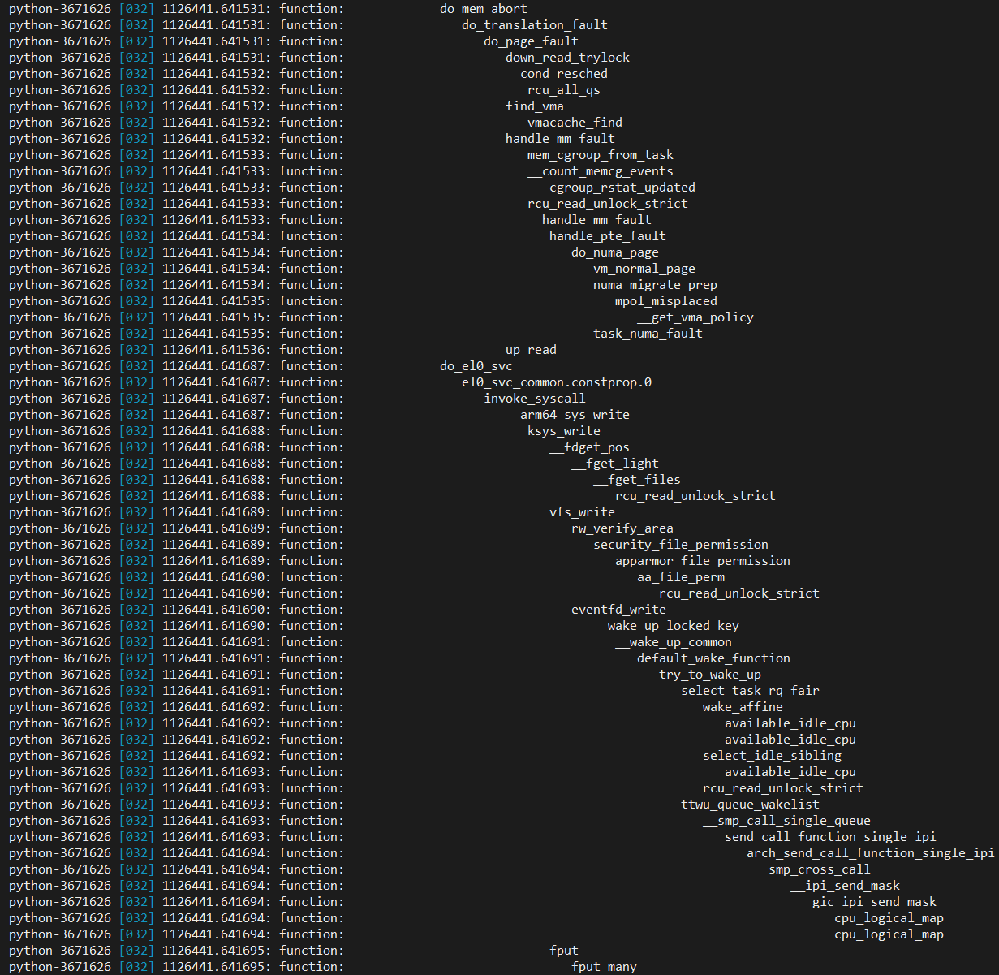


