# RL强化学习场景性能数据采集及分析指导

随着DeepSeek-R1的发布，大模型强化学习（RL）训练受到广泛关注。在昇腾NPU环境下，verl和mindspeed-rl等框架已积累了丰富的性能调优经验。本文系统总结了包括性能数据采集与分析在内的方法论，旨在帮助开发者更高效地运用MindStudio工具链，实现强化学习场景下的性能优化。

## 1. 强化学习概述

本节以GRPO（Group Relative Policy Optimization）算法为例，介绍强化学习的计算流程、主流框架设计及部署方式。。

### 1.1 强化学习计算流程

1. **Rollout**：策略（actor）模型基于输入的prompt序列，推理生成回答（response序列）
2. **ref logprob**：基于prompt和生成的response，reference模型计算ref logprob用于KL散度计算
3. **logprob**：基于prompt和生成的response，actor模型计算logprob用于重要性采样
4. **reward**：基于prompt和生成的response，奖励模型评估奖励值R_N。
5. **update**：基于计算得到的R_N、ref logprob、logprob计算优化函数和策略梯度，对actor模型进行更新

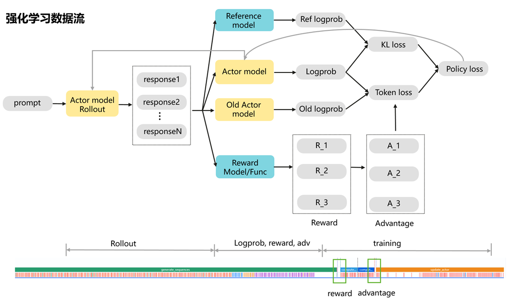

### 1.2 强化学习主流框架

RL算法涉及多个模型计算流程，且存在复杂的数据依赖关系，需要高效、灵活的分布式训练框架。以VeRL为例，该框架将强化学习数据流抽象为控制流和计算流：

* **控制流**：负责多个模型角色的交互逻辑
* **计算流**：负责单个模型的计算流程
  基于Ray分布式框架，VeRL将每个计算进程抽象为worker，在主进程中持有各worker的操作句柄，实现对整体流程的控制。

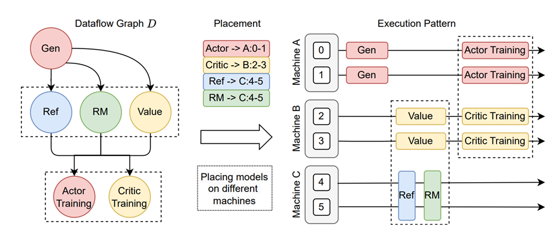

VeRL流程中，主进程作为控制流，负责算法流程控制和各计算阶段数据流通。每个worker进程对应一个NPU设备，负责具体计算任务，进程间通过Ray进行数据通信。

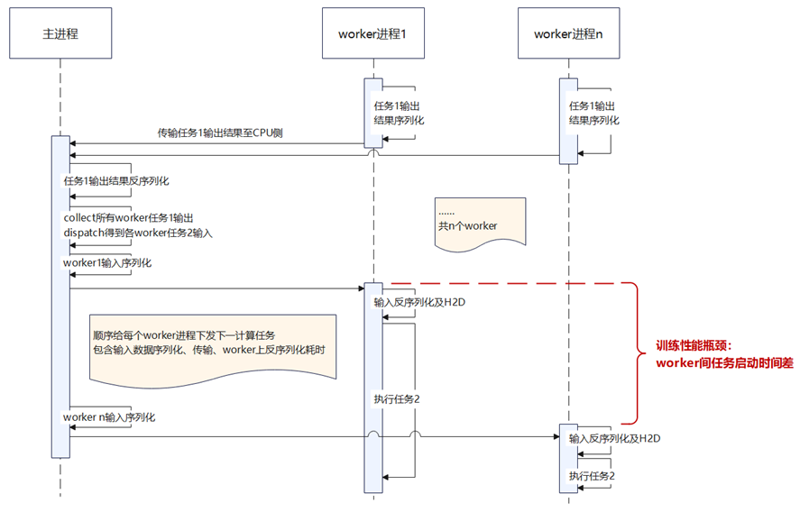

### 1.3 强化学习部署方式

当前RL工程实现主要采用两种部署模式：
**共卡部署：**
•(全) 共卡部署，每个节点都依次进行所有步骤计算
•不同阶段间不存在数据依赖导致的空泡时间；资源调整简单
•主要空泡来自于推理阶段负载不均导致
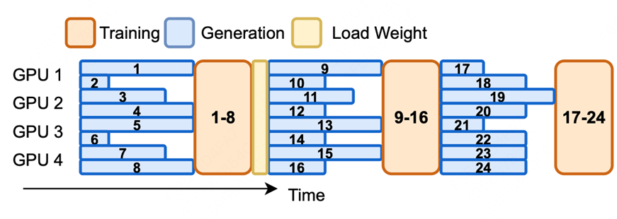
**分离部署：**
•分离部署，节点分工不同，每个节点只负责其中一个步骤计算
•资源配比更加灵活；不同阶段间没有 offload/onload 模型开销
•On-policy算法要求采样序列和更新为同一模型，因此actor生成和训练之间需要相互等待
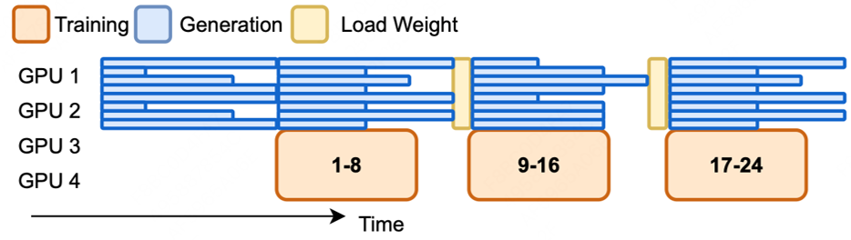

---

## 2. MindStudio Profiler性能调优工具链介绍

### 2.1 Profiler 性能数据采集

MindStudio提供多种系统级性能数据采集方式，可根据需求选择合适的方案精准定位性能瓶颈。采集方式分为两大类：

* **命令行采集（msprof）**
* **AI框架Profiler接口采集（Ascend PyTorch Profiler、MindSpore Profiler）**

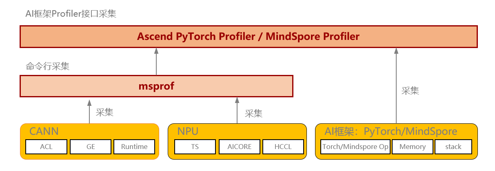

**Ascend PyTorch Profiler**是针对PyTorch框架开发的性能采集工具，支持采集PyTorch框架和昇腾软硬件数据，提供完整的性能分析信息。接口与社区torch.profiler接口对齐，如下所示：
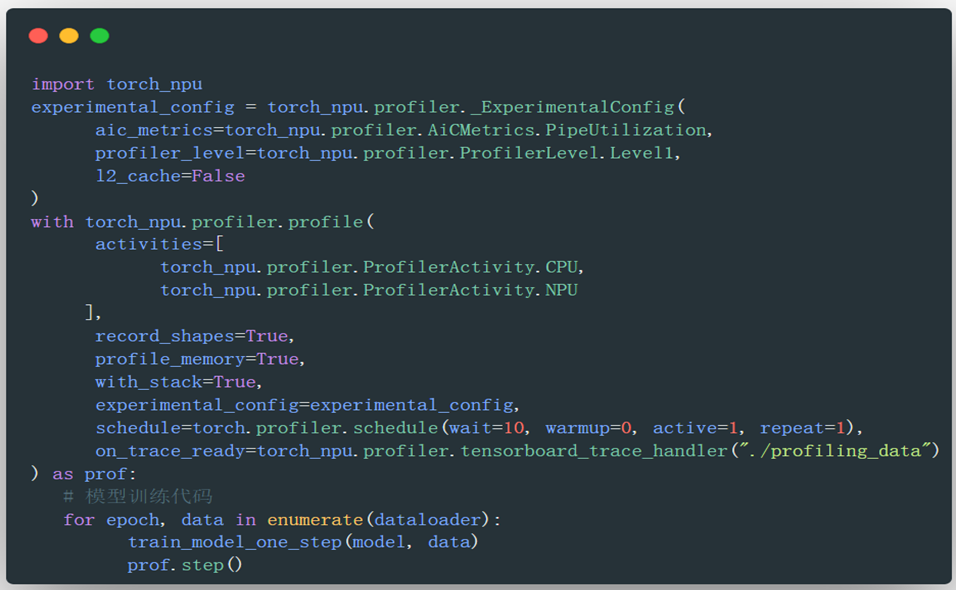
**Ascend PyTorch Profiler 性能采集配置参数说明**

1. **基础参数配置**
   `torch_npu.profiler.profile` 的参数体系完全对标PyTorch Profiler，主要包含以下核心功能配置：
   * `activities`: CPU、NPU事件采集列表。
   * `record_shapes`: 算子的InputShapes和InputTypes，Bool类型。
   * `profile_memory`: 算子的内存占用情况，Bool类型，默认为False
   * `with_stack`: 算子调用栈，Bool类型，默认为False。
   * `schedule`: 设置不同step的行为，Callable类型，通常使用torch_npu.profiler.schedule函数作为参数，通过与profiler.step()接口共同起作用。
   * `on_trace_ready`: 设置采集结束时执行的操作，Callable类型。通常选择tensorboard_trace_handler，该接口用于解析采集的Profiling数据。
2. **NPU专属扩展配置**
   通过 `experimental_config` 参数提供昇腾NPU特有的性能采集项，主要包含以下核心功能配置：
   * `export_type`：导出的性能数据结果文件格式，List类型，例如["db", "text"]。**推荐设置db类型，方便后续的性能分析**
   * `msprof_tx`：打点控制开关，通过开关开启自定义打点功能，bool类型
   * `mstx_domain_include`：输出需要的domain数据。调用torch_npu.npu.mstx系列打点接口，可选择只输出本参数配置的domain数据
   * `mstx_domain_exclude`：过滤不需要的domain数据
   * `profiler_level`：设置NPU采集的Level，支持以下配置：


     | ProfilerLevel | Profiling数据                                                             |
     | ------------- | ------------------------------------------------------------------------- |
     | Level0        | 框架侧及Device侧算子执行耗时，为默认值。                                  |
     | Level1        | Level0基础上增加CANN软件栈中AscendCL接口、HCCL通信及AI Core的性能指标数据 |
     | Level2        | Level1基础上增加CANN软件栈的Runtime数据及AI CPU数据                       |
   * `aic_metrics`：AI Core的性能指标采集项，Level0时该配置不生效。参数具体配置项如下：


     | AicMetrics            | Metrics数据                           |
     | --------------------- | ------------------------------------- |
     | AiCoreNone            | 关闭AI Core的性能指标采集，默认值。   |
     | PipeUtilization       | 计算单元和搬运单元耗时占比            |
     | ArithmeticUtilization | 各种计算类指标占比统计                |
     | Memory                | 外部内存读写类指令占比                |
     | MemoryL0              | L0内存读写类指令占比                  |
     | ResourceConflictRatio | 流水线队列类指令占比                  |
     | MemoryUB              | 内部内存                              |
     | L2Cache               | 读写cache命中次数和缺失后重新分配次数 |
   * `l2_cache`：l2 cache数据采集开关
3. [详细资料](https://www.hiascend.com/document/detail/zh/canncommercial/82RC1/devaids/Profiling/atlasprofiling_16_0033.html)

**Profiler采集结果**
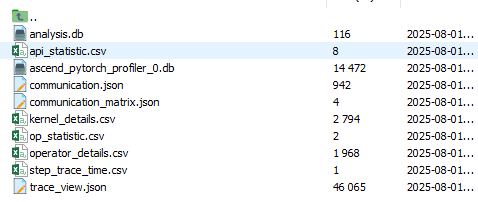

### 2.2 MSTX 自定义打点接口

mstx接口是MindStudio提供的一个性能打点接口，允许开发者在应用程序中插入特定标记，精准定位关键代码区域的性能数据。该接口可对接mindstudio profiler工具链，自由度高，数据轻量化。mstx原理如下图所示：

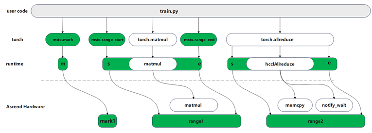

**torch_npu封装的MSTX接口：**

* `torch_npu.npu.mstx.mark`：标识瞬时事件（如"训练开始"）
* `torch_npu.npu.mstx.range_start/range_end`：标识时间段事件（如"前向传播"、"反向传播"等）

**使用说明：**

* 不传入stream参数：仅记录CPU侧时间信息，适用于纯CPU操作
* 传入stream参数：记录CPU侧时间及对应NPU侧时间信息
* 采集时需在`experimental_config`中设置`msprof_tx=True`

**应用示例1**: 通过`torch_npu.npu.mstx.range_start/range_end`接口，在verl代码中（verl/workers/megatron_workers.py）标记rollout阶段generate_sequence耗时:

```python
with simple_timer("generate_sequences", timing_generate):
	mstx_id=torch_npu.npu.mstx.range_start("vllm_generate_sequences")
	output = self.rollout.generate_sequences(prompts=prompts)
	torch_npu.npu.mstx.range_end(mstx_id)
```

mindstudio insight中显示效果如下，可以看出打点的耗时。同时，通过集合不同rank的打点数据，可以观察出不同dp之间，generate阶段的负载不均情况：
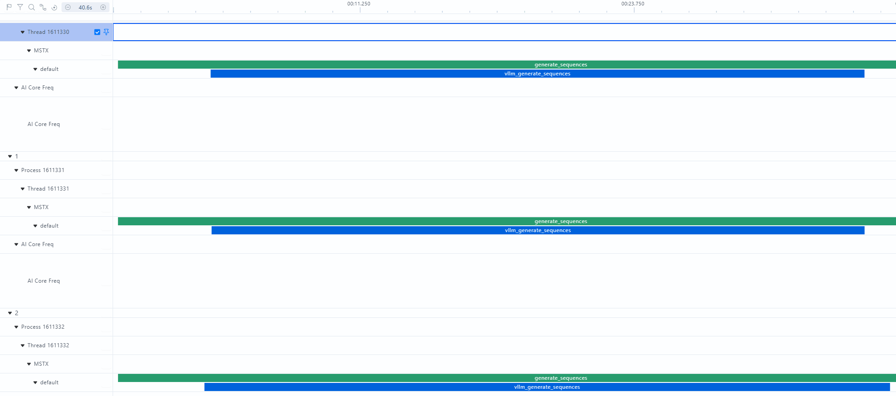

**应用示例2: ** 通过`torch_npu.npu.mstx.range_start/range_end`接口，在vllm代码(vllm/entrypoints/llm.py)中标记一个decode step的耗时:

```python
while self.llm_engine.has_unfinished_requests():
    range_id = torch_npu.npu.mstx.range_start("vllm_one_step", domain="vllm_one_step")
    step_outputs = self.llm_engine.step()
    torch_npu.npu.mstx.range_end(range_id, domain="vllm_one_step")
```

mindstudio insight中显示效果如下，可以看出vllm每个decode step的时间，以及整体的耗时：
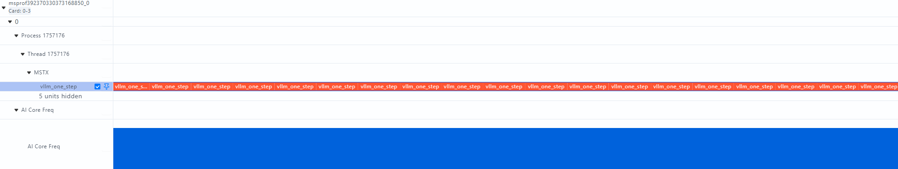

### 2.3 msprof-analyze 性能分析

msprof-analyze基于采集的性能数据进行数据拆解、分析，提供命令行&可视化调试调优工具，帮助开发者快速识别AI作业中的性能瓶颈。资料见：
[mstt/profiler/msprof\_analyze · Ascend/mstt - GitCode](https://gitcode.com/Ascend/mstt/tree/master/profiler/msprof_analyze/)

msprof-analyze对于集群任务，提供多种recipe能力，包括性能拆解、通信分析、Host下发分析、强化学习等多样分析能力。执行方式如下：

```
#只传入cluster_data性能数据文件夹，输入cluster_time_summary分析能力，在cluster_data输入文件夹下生成cluster_analysis_output文件夹，保存分析结果信息 
msprof-analyze cluster -m cluster_time_summary -d ./cluster_data -o output_path
```

msprof-analyze能力全集如下所示：
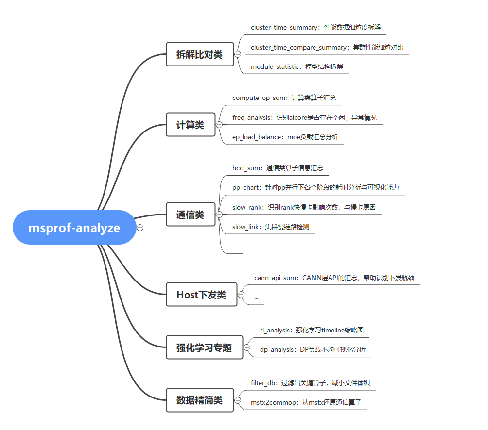
接下来对RL场景几种典型的能力进行介绍：

#### 2.3.1 slow_rank

`slow_rank`分析能力通过投票机制找出影响最大的慢卡，执行方式如下：

```
#-d指定采集的profiler数据，-o指定数据输出目录
msprof-analyze -m slow_rank -d ./cluster_data -o ./output
```

打开交付件可以清晰的查看到，慢节点的投票次数：
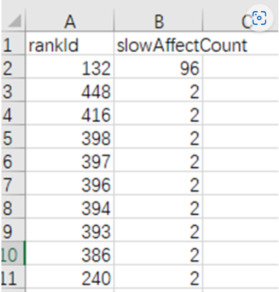
通过slow_rank可以帮助快速找出集群中的慢节点，特别是对于强化学习训练阶段，当集群规模较大，易出现慢节点的情况。可以采集profiler数据后，使用slow_rank功能快速定位慢节点。

#### 2.3.2 module_statistic

`module_statistic`可自动解析模型层级结构，帮助精准定位性能瓶颈，为模型优化提供关键洞察，适用于强化学习推理、训练的模型结构解析：

```
#-d指定采集的profiler数据，-o指定数据输出目录
msprof-analyze -m module_statistic -d ./cluster_data -o ./output
```

交付件可视化效果如下：

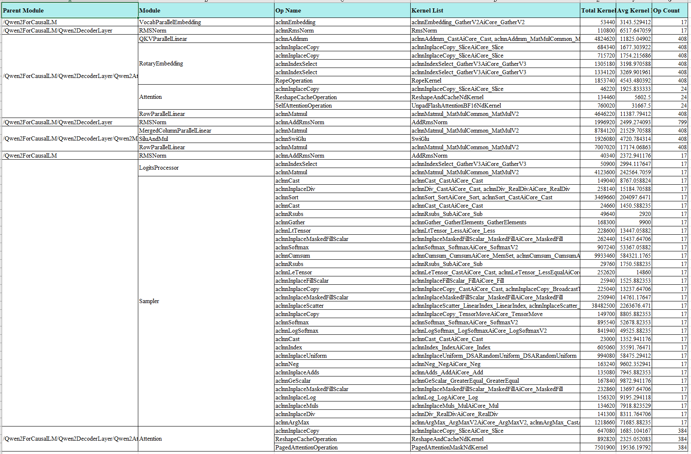

可对强化学习推理、训练阶段的性能数据进行模型结构解析，详细参考资料：[module_statistic](https://gitcode.com/Ascend/mstt/blob/pre-research/profiler/msprof_analyze/docs/features/module_statistic.md)

#### 2.3.3 pp_chart

``pp_chart``通过mstx采集pp流水数据，使用`pp_chart`分析能力、MindStudio Insight 工具呈现pp流水图：

```
#-d指定采集的profiler数据，-o指定数据输出目录
msprof-analyze -m pp_chart -d ./cluster_data -o ./output
```

pp流水图呈现效果如下：

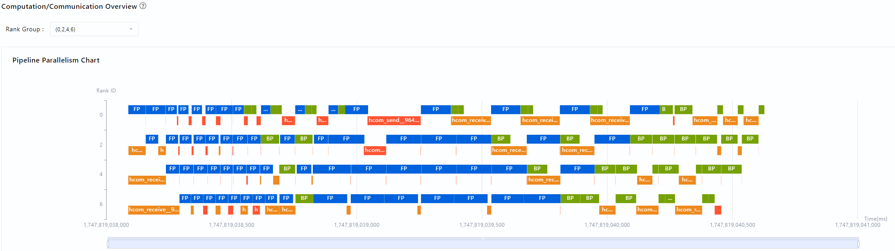

pp流水图可直观的观察到不同pp通信域的负载情况，详细使用资料：[pp_chart](https://gitcode.com/Ascend/mstt/blob/pre-research/profiler/msprof_analyze/docs/features/pp_chart.md)。

#### 2.3.4 cluster_time_summary

``cluster_time_summary``提供了集群训练过程中迭代耗时拆解，包括计算、通信和内存拷贝等各部分的时间消耗，帮助用户找到性能瓶颈。

```
#-d指定采集的profiler数据，-o指定数据输出目录
msprof-analyze -m cluster_time_summary -d ./cluster_data -o ./output
```

输出数据呈现效果如下所示：

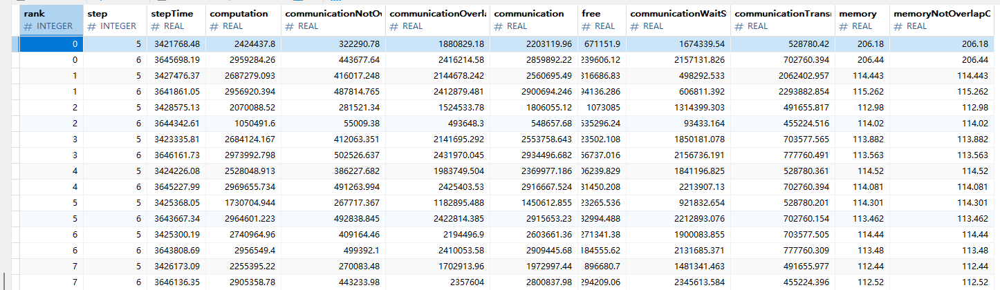

cluster_time_summary可以拆解出每个rank的每个step时间，以及每个step的通讯、计算、空闲、内存等各部分的时间消耗。详细使用资料：[cluster_time_summary](https://gitcode.com/Ascend/mstt/blob/pre-research/profiler/msprof_analyze/docs/features/cluster_time_summary.md)

#### 2.3.5 dp_analysis

``dp_analysis``分析能力可用于解决vllm推理引擎离线调用以及推理长度不断增加的场景下，DP域间负载情况的可视化观察问题。

```
#-d指定采集的profiler数据，-o指定数据输出目录
msprof-analyze -m dp_analysis -d ./cluster_data -o ./output
```

交付件可视化效果如下：
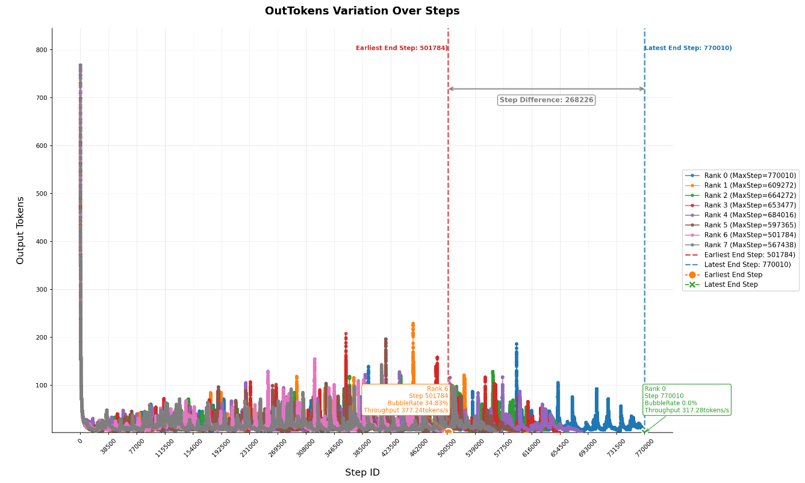

dp_analysis分析能力可统计每个DP域空等比例以及吞吐速率，并通过并发量折线图直观反映DP域间负载不均衡现象：[dp_analysis](https://gitcode.com/Ascend/mstt/blob/pre-research/profiler/msprof_analyze/docs/features/dp_analysis.md)

#### 2.3.6 rl_analysis

``rl_analysis``分析能力提供标准化的强化学习各阶段mstx打点数据汇总能力，提供强化学习各阶段耗时汇总能力，可生成全局timeline缩略图。

```
#-d指定采集的profiler数据，-o指定数据输出目录
msprof-analyze -m rl_analysis -d ./cluster_data -o ./output
```

生成的timeline缩略图可视化效果如下：

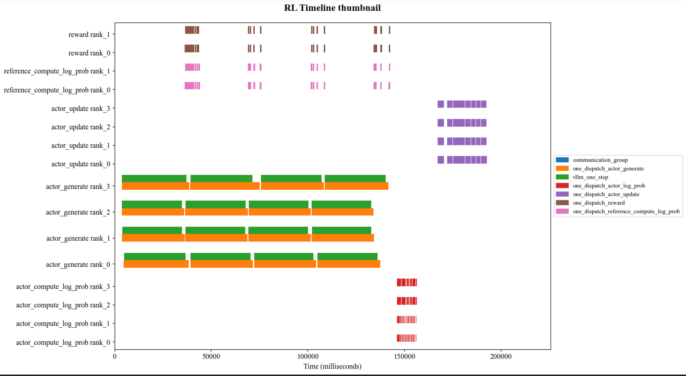

rl_analysis分析能力可以按照全局rank、dp rank区分，轻量化地获取强化学习各阶段的耗时情况，并提供mstx打点的拆解能力。详细资料：[rl_analysis](https://gitcode.com/Ascend/mstt/blob/pre-research/profiler/msprof_analyze/docs/features/rl_analysis.md)

---

## 3. 强化学习框架profiler性能数据采集及性能调优方法论

### 3.1 强化学习框架开启profiling采集数据

主流RL框架均已适配PTA Profiler，可通过YAML配置一键采集数据：


| 框架名称     | 性能数据采集指导链接                                                                                 |
| ------------ | ---------------------------------------------------------------------------------------------------- |
| VeRL         | [链接](https://github.com/verl-project/verl)    |
| MindSpeed-RL | [链接](https://gitee.com/ascend/MindSpeed-RL/blob/master/docs/features/profiler.md)                  |
| MindRLHF     | [链接](https://gitee.com/mindspore/mindrlhf/blob/master/docs/features/profiler.md)                   |
| siiRL        | [链接](https://github.com/sii-research/siiRL) |

以VeRL为例，可在启动脚本所需要的yaml中配置profiler相关参数，例如在verl/trainer/config/ppo_trainer.yaml或verl/trainer/config/ppo_megatron_trainer.yaml脚本中配置以下参数：

```
global_profiler:
   tool: npu
   steps: [1, 2, 5]
   save_path: "outputs/profile"
actor_rollout_ref:
   actor:
      profiler:
         enable: True
         all_ranks: True
         tool_config:
            npu:
		level: level1
                discrete: False
		contents: [cpu,npu]
  # 注意：在共卡场景，不支持单独设置rollout配置，rollout遵循actor的配置
  # rollout & ref follow actor settings
```

关键参数说明：

* **global_profiler**：全局采集配置（工具、steps、保存路径）
* **discrete**：控制不同阶段数据是否分离采集，设置该参数后，actor_compute_log_prob、actor_update等阶段的profiling数据，分别会落到不同的文件夹
* **contents**：可配置profiler采集项，例如memory（内存信息）、module（调用栈）
* **共卡场景中，不支持单独设置rollout配置，rollout遵循actor的配置**
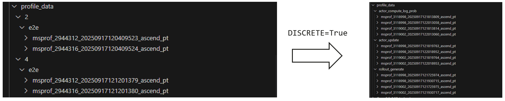

此外，verl也同时支持在启动脚本中直接添加相关参数，例如：

```
set -x

   # profiling configuration
   PROFILE_STEPS="[2,4]"
   PROFILE_RANKS_ALL=False
   DISCRETE=True
   PROFILE_RANKS="[1,2]"

   # profiling NPU options
   SAVE_PATH="$HOME/profile_data"
   LEVEL="level1"
   CONTENTS=['npu','cpu']
   ANALYSIS=True

   python3 -m verl.trainer.main_ppo \
       algorithm.adv_estimator=grpo \
       data.train_files=$HOME/data/gsm8k/train.parquet \
       data.val_files=$HOME/data/gsm8k/test.parquet \
       data.train_batch_size=32 \
       data.max_prompt_length=1024 \
       data.max_response_length=1024 \
       data.filter_overlong_prompts=True \
       data.truncation='error' \
       actor_rollout_ref.model.path=Qwen/Qwen2.5-7B-Instruct \
       actor_rollout_ref.model.enable_gradient_checkpointing=True \
       actor_rollout_ref.model.use_remove_padding=False \
       actor_rollout_ref.actor.optim.lr=5e-8 \
       actor_rollout_ref.actor.ppo_mini_batch_size=2 \
       actor_rollout_ref.actor.ppo_micro_batch_size_per_gpu=1 \
       actor_rollout_ref.actor.use_kl_loss=True \
       actor_rollout_ref.actor.entropy_coeff=0 \
       actor_rollout_ref.actor.kl_loss_coef=0.001 \
       actor_rollout_ref.actor.kl_loss_type=low_var_kl \
       actor_rollout_ref.actor.fsdp_config.param_offload=False \
       actor_rollout_ref.actor.fsdp_config.optimizer_offload=False \
       actor_rollout_ref.actor.profiler.enable=True \
       actor_rollout_ref.actor.profiler.ranks=$PROFILE_RANKS \
       actor_rollout_ref.actor.profiler.all_ranks=$PROFILE_RANKS_ALL \
       actor_rollout_ref.actor.profiler.tool_config.npu.discrete=$DISCRETE \
       actor_rollout_ref.actor.profiler.tool_config.npu.contents=$CONTENTS \
       actor_rollout_ref.actor.profiler.tool_config.npu.level=$LEVEL \
       actor_rollout_ref.actor.profiler.tool_config.npu.analysis=$ANALYSIS \
       actor_rollout_ref.rollout.log_prob_micro_batch_size_per_gpu=1 \
       actor_rollout_ref.rollout.tensor_model_parallel_size=4 \
       actor_rollout_ref.rollout.name=vllm \
       actor_rollout_ref.rollout.gpu_memory_utilization=0.3 \
       actor_rollout_ref.rollout.n=4 \
       actor_rollout_ref.rollout.enable_chunked_prefill=False \
       actor_rollout_ref.ref.log_prob_micro_batch_size_per_gpu=1 \
       actor_rollout_ref.ref.fsdp_config.param_offload=True \
       actor_rollout_ref.ref.profiler.enable=True \
       actor_rollout_ref.ref.profiler.ranks=$PROFILE_RANKS \
       actor_rollout_ref.ref.profiler.all_ranks=$PROFILE_RANKS_ALL \
       actor_rollout_ref.ref.profiler.tool_config.npu.discrete=$DISCRETE \
       actor_rollout_ref.ref.profiler.tool_config.npu.contents=$CONTENTS \
       actor_rollout_ref.ref.profiler.tool_config.npu.level=$LEVEL \
       actor_rollout_ref.ref.profiler.tool_config.npu.analysis=$ANALYSIS \
       algorithm.use_kl_in_reward=False \
       trainer.critic_warmup=0 \
       trainer.logger=console \
       trainer.project_name='verl_grpo_example_gsm8k' \
       trainer.experiment_name='qwen2_5_7b_function_rm' \
       trainer.n_gpus_per_node=8 \
       trainer.nnodes=1 \
       trainer.save_freq=-1 \
       trainer.test_freq=5 \
       trainer.total_epochs=5 \
       trainer.device=npu \
       global_profiler.tool=npu \
       global_profiler.steps=$PROFILE_STEPS \
       global_profiler.save_path=$SAVE_PATH
```

### 3.2 强化学习场景调优方法论

强化学习涉及推理、训练、进程间数据传输等多个环节，各阶段均可能存在性能瓶颈。本节以VeRL为例，介绍如何基于MindStudio工具链定位不同阶段的性能问题。

#### 3.2.1 整体性能概览分析

通过MSTX打点获取系统整体性能视图，分析各计算阶段、数据传输和模型调度的耗时分布。

**操作步骤：**

1. 参考2.2节的MSTX打点接口，在verl关键计算和数据传输函数中添加打点。
2. 开启Profiler数据采集（建议采用最简配置，减少数据量）：
   - level：level_none
   - contents：[npu]
   - analysis: True
   - discrete: False
3. 采集完成后分析各阶段关键函数耗时。

**分析要点：**

**1. 长耗时任务与资源空闲分析**

* **操作**：使用MindStudio Insight加载profiling数据，自动识别不同计算阶段，通过RL页签流水图定位长耗时任务与NPU资源空泡
* **价值**：快速掌握不同阶段耗时占比
* **效果展示**： 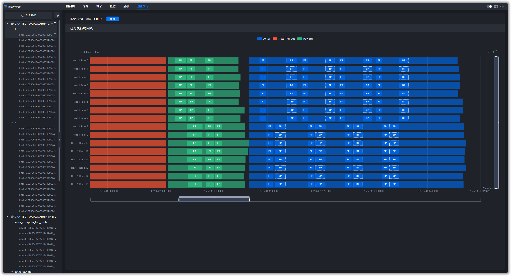
* **参考文档**：[基于veRL + GRPO的训练性能剖析](https://openx.huawei.com/communityHome/postDetail?postId=17609&id=344&source=openxAcSquare)

**2. 负载均衡分析**

* **操作**：通过MindStudio Insight直接查看MSTX打点数据，观察Rollout阶段不同DP Rank的负载均衡情况
* **价值**：快速识别负载不均问题
* **效果展示**：
  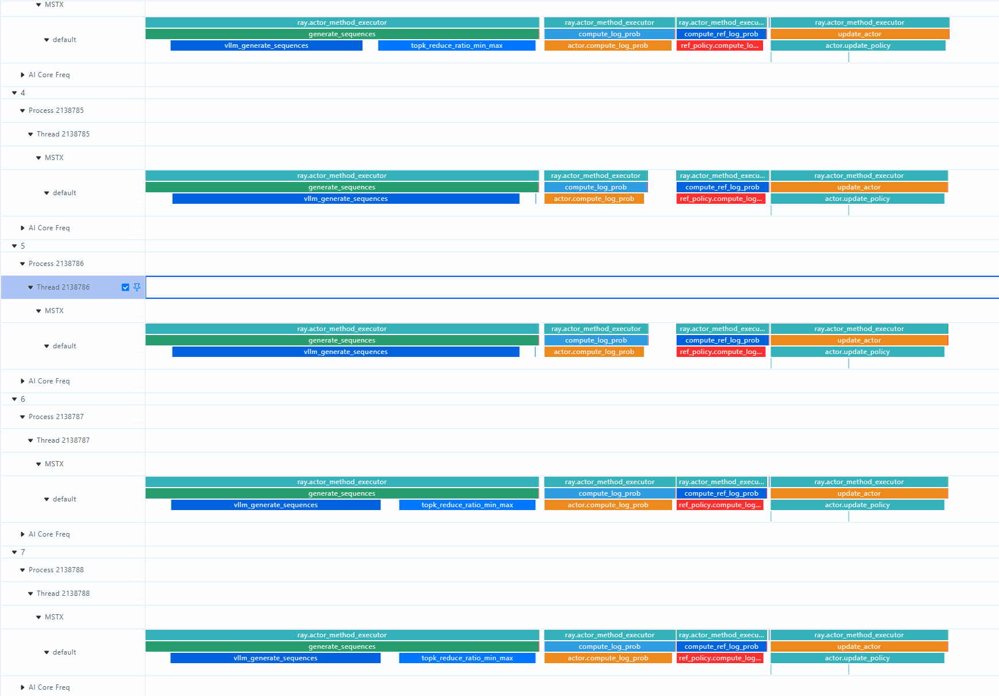

**3. 集群整体性能分析**

* **操作**：结合MSTT的rl_analysis功能，生成集群Timeline缩略图，观察各阶段整体耗时
* **价值**：宏观掌握集群性能瓶颈
* **操作指南**：[rl\_analysis使用文档](https://gitcode.com/Ascend/mstt/blob/pre-research/profiler/msprof_analyze/docs/features/rl_analysis.md)
* **效果展示**：
  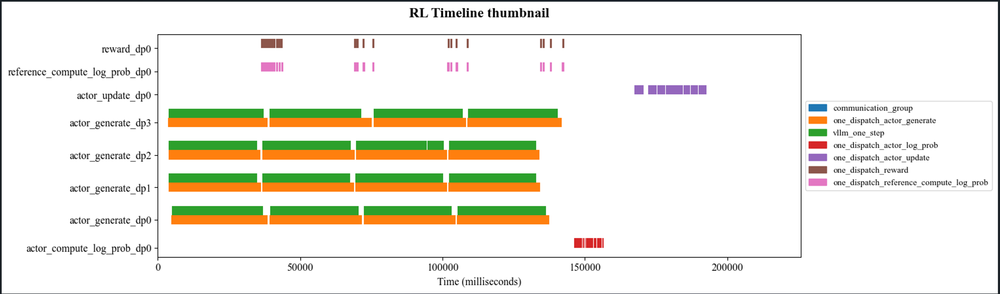

**上述方案优势：**

* 数据轻量，采集开销小
* 分析流程简单高效
* 适合调优初期快速掌握性能状况

#### 3.2.2 细粒度性能分析

在掌握整体性能概况后，可采集细粒度Profiling数据进行深入分析。

**操作步骤：**

1. 使用强化学习框架内置的 Profiling 功能，分阶段采集详细性能数据。
2. 设置 `profile_level` 为 `level1`（便于分析通信性能瓶颈）。
3. 设置 `discrete: True`。
4. 如需采集内存数据，需设置 `contents: [npu, cpu, memory, module]`。

**分析要点：**

**一、性能分析**

* **使用 mstt 工具进行集群性能分析**

  * **操作**：采集性能数据后，调用 `mstt slow_rank`、`module_statistic`、`cluster_time_summary` 对集群性能数据进行拆解分析，具体操作参见第 2.3 节。
  * **价值**：实现集群性能数据的自动化高效分析，快速定位问题。
  * **效果展示**：详见第 2.3 节。
* **使用 MindStudio Insight 进行分析**

  * **操作**：可通过 MindStudio Insight Windows 或 Linux 版本加载 Profiling 数据（Linux 版本无需将数据下载至 Windows，分析效率更高）。Linux 版本操作详见：[MindStudio Insight Jupyter插件版安装指导](https://openx.huawei.com/communityHome/postDetail?postId=18147&id=344)。
  * **价值**：MindStudio Insight 支持分析任务调度效率、算子执行性能、计算资源利用率、集合通信性能等。其 Timeline 视图具备任务拆解与 Overlap 分析功能（**为 MindStudio 独有核心特性，在 NV 及其他竞品中不具备，是 AI 调优的必备工具**），并支持鼠标交互式分析。
  * **效果展示**：
    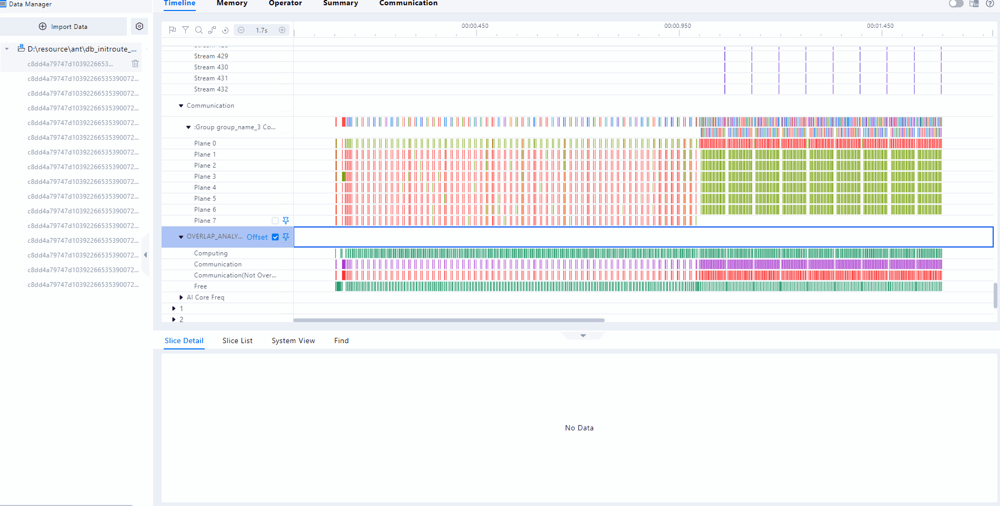

**二、内存分析**

* **通过 Profiling 结合调用栈分析系统内存变化**

  * **操作**：采集数据时开启调用栈和内存视图功能。
  * **价值**：观察框架、CANN内存申请释放情况，可结合调用栈跟踪到前端python代码。
  * **效果展示**：结合调用栈进行内存变化分析。效果如下所示：
    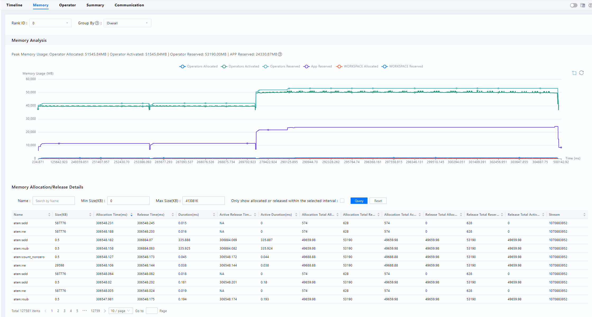
* **使用 msleaks 工具进行深层次内存分析**

  * **操作步骤**：参考 [msleaks 工具使用指南](https://www.hiascend.com/document/detail/zh/CANNCommunityEdition/83RC1alpha003/devaids/msleaks/atlas_msleaks_0001.html)。
  * **价值**：可以查看框架内存申请总量折线图/内存块图，并直接对应调用栈，可深层次分析框架内存使用情况。
  * **效果展示**：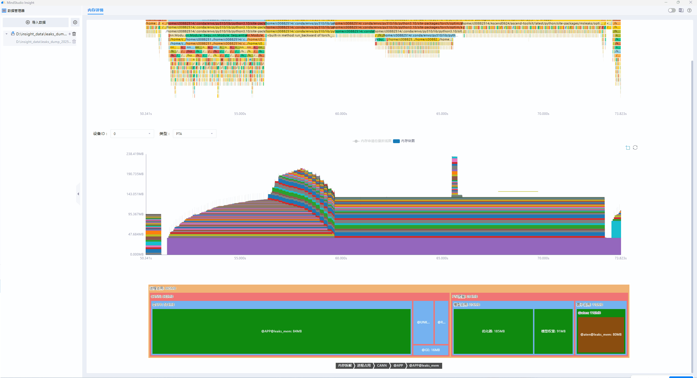

#### 3.2.3 强化学习端到端调优流程

完整的调优流程如下图所示：
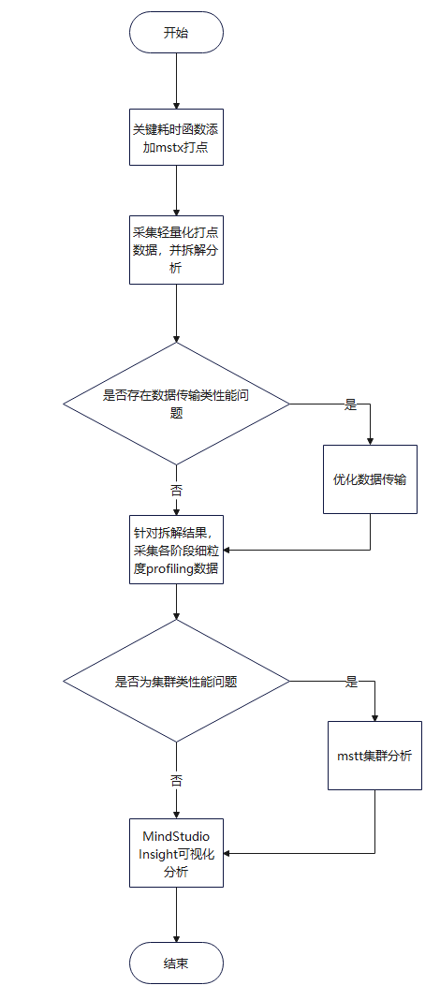

---

## 4. 强化学习性能调优案例

基于verl、mindspeed-rl的调优实践整理如下，其中也包含mindstudio profiler工具链的实践使用。通过调优案例可以发现，按照分析方法论使用mindstudio profiler工具链，可以大幅度提升调优效率。


[1. 基于MindSpeed-RL的DeepSeek R1强化学习的系统优化](https://2012labs.huawei.com/#/campaign/series/1163218083196043264/detail)
[2. 基于MindSpeed-RL的DAPO长序列场景调优实践]

---

## 5. 常见问题

### 5.1 细粒度性能数据过大

**问题描述：**

长序列推理时，vLLM decode次数与序列长度成正比，产生大量Profiler数据。Update阶段的micro batch计算也会生成大量数据。

**解决方案：**

1. 模型减层（推理和训练的性能数据呈比例减少）
2. 减少推理序列长度（推理阶段的性能数据成比例减少）
3. 减少GBS，减少num_samples（训练的性能数据呈比例减少）
4. 在vLLM（以vllm框架为例）、VeRL中手动添加profiler实例，采集特定的推理的decode step和mic batch。具体配置可以参考：

**vLLM推理配置示例（vllm/entrypoints/llm.py）：**

```python
def _run_engine(
            self, *, use_tqdm: bool
    ) -> List[Union[RequestOutput, PoolingRequestOutput]]:
        # Initialize tqdm.
        if use_tqdm:
            num_requests = self.llm_engine.get_num_unfinished_requests()
            pbar = tqdm(
                total=num_requests,
                desc="Processed prompts",
                dynamic_ncols=True,
                postfix=(f"est. speed input: {0:.2f} toks/s, "
                         f"output: {0:.2f} toks/s"),
            )

        # Run the engine.
        outputs: List[Union[RequestOutput, PoolingRequestOutput]] = []
        total_in_toks = 0
        total_out_toks = 0
        import torch_npu
        experimental_config = torch_npu.profiler._ExperimentalConfig(
            profiler_level=torch_npu.profiler.ProfilerLevel.Level1,
            export_type=torch_npu.profiler.ExportType.Db,
        )
        prof = torch_npu.profiler.profile(
            schedule=torch_npu.profiler.schedule(wait=0, warmup=0, active=1, repeat=1, skip_first=0),  #控制采集profiler的step
            on_trace_ready=torch_npu.profiler.tensorboard_trace_handler("./result"),
            record_shapes=True,
            with_modules=False,
            experimental_config=experimental_config
        )
        prof.start()
        while self.llm_engine.has_unfinished_requests():
            step_outputs = self.llm_engine.step()
            prof.step()
    # ... 其余代码
```

**训练阶段配置（verl/workers/actor/megatron_actor.py）：**

```python
@GPUMemoryLogger(role="megatron actor", logger=logger)
def update_policy(self, dataloader: Iterable[DataProto]) -> dict:
    """Update the policy with an iterator of DataProto
  
    Args:
        dataloader (Iterable[DataProto]): an iterator over the DataProto that returns by ``make_minibatch_iterator``
            The keys of each data batch is described in the make_minibatch_iterator.
  
    Returns:
        Dict: a dictionary containing the statistics. Note that the statistics are only valid in the last pp stage
        and users have to combine the output in each dp rank manually.
  
    """
    metrics = {}
    if self.use_torch_profiler and self.prof and self.prof.enable:
        self.prof.start()
    import torch_npu
    experimental_config = torch_npu.profiler._ExperimentalConfig(
        profiler_level=torch_npu.profiler.ProfilerLevel.Level1,
        export_type=torch_npu.profiler.ExportType.Db,
    )
    prof = torch_npu.profiler.profile(
        schedule=torch_npu.profiler.schedule(wait=0, warmup=0, active=1, repeat=1, skip_first=0),  #控制采集profiler的step
        on_trace_ready=torch_npu.profiler.tensorboard_trace_handler("./result"),
        record_shapes=True,
        with_modules=False,
        experimental_config=experimental_config
    )
    for data in dataloader:
        self.actor_optimizer.zero_grad()
        # use use_contiguous_buffers_in_local_ddp and no overlap_dp_param_comm
        for chunk in self.actor_module:
            # if use distributed optimizer, zero grad buffer will be handled by optimizer
            chunk.zero_grad_buffer()
  
        calculate_entropy = self.config.entropy_coeff != 0
        if data.meta_info.get("micro_batch_size", None) is not None:
            micro_batch_size = data.meta_info["micro_batch_size"]
        else:
            micro_batch_size = self.config.ppo_micro_batch_size_per_gpu
        max_token_len = None
        if self.config.use_dynamic_bsz:
            max_token_len = self.config.ppo_max_token_len_per_gpu * self.config.megatron.context_parallel_size
        metric_micro_batch = self.forward_backward_batch(
            data,
            calculate_entropy=calculate_entropy,
            use_dynamic_bsz=self.config.use_dynamic_bsz,
            micro_batch_size=micro_batch_size,
            max_token_len=max_token_len,
        )
        metric_micro_batch = metric_micro_batch["output"]
        for metric in metric_micro_batch:
            # Note that o[0] is metrics, o[1] is entropy, o[2] is response_mask
            append_to_dict(metrics, metric)  # append the metric from this micro-batch to global metrics.
  
        update_successful, grad_norm, num_zeros_in_grad = self.actor_optimizer.step()
        data = {"actor/grad_norm": grad_norm}
        append_to_dict(metrics, data)
  
        if update_successful:
            # allgather already execute in optimizer.step in new megatron
            pass
        else:
            raise NotImplementedError
        if self.use_torch_profiler and self.prof and self.prof.enable:
            self.prof.step()
        prof.step()
	#其余代码
```

```